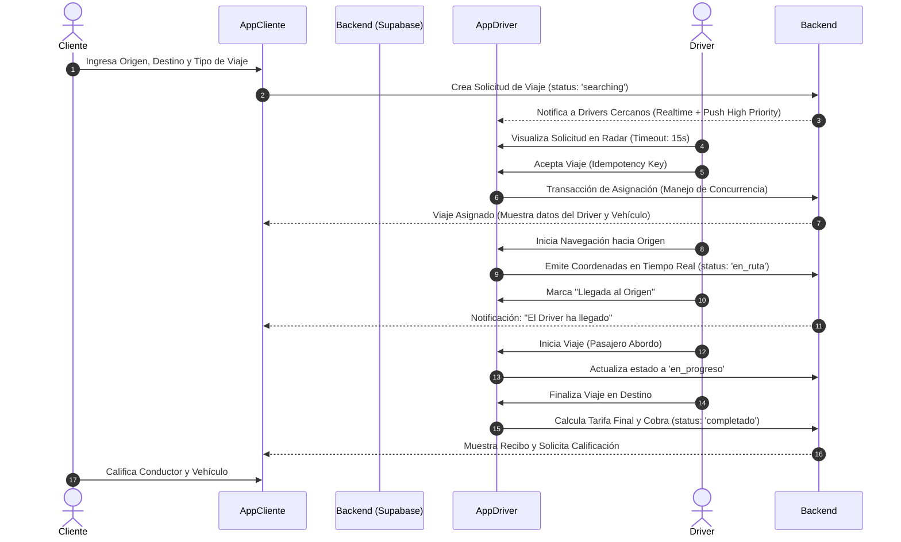
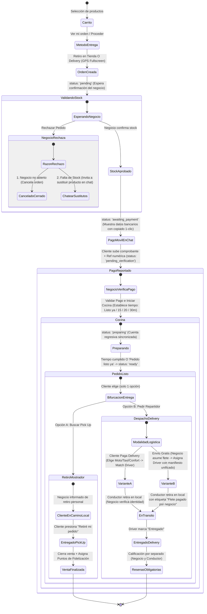
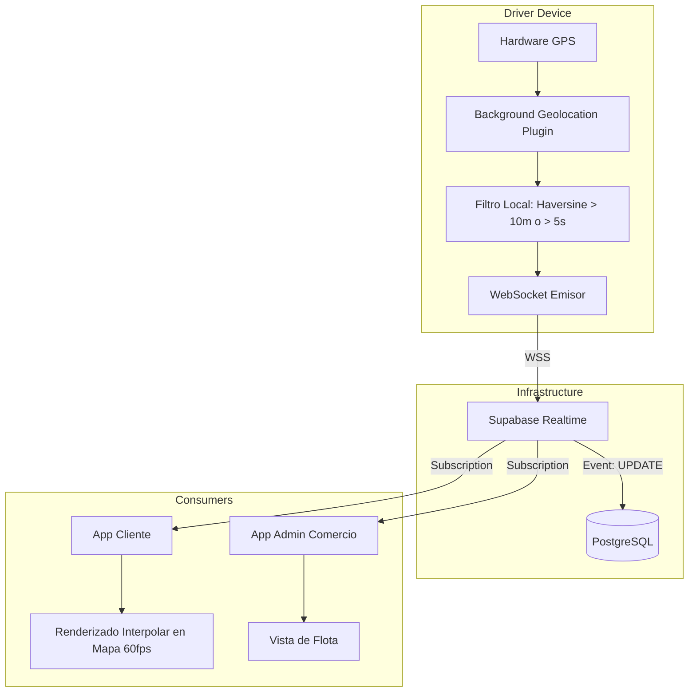

# Blueprint Arquitectónico y Diagramas de Flujo del Sistema (Un 2x3)

Este documento describe la arquitectura base, los ciclos de vida de negocio y las pipelines de infraestructura críticas para el funcionamiento de **"Un 2x3"** (App Cliente, App Negocio/Restaurante, App Conductor/Driver). El sistema se divide funcionalmente en Ride-Hailing, E-Commerce con Despacho Logístico, y Tracking GPS, operando bajo un entorno híbrido React/Capacitor respaldado exclusivamente por Supabase (PostgreSQL, Realtime, Storage, Auth), optimizado para alto rendimiento y máxima resiliencia operativa.

---

## 1. Flujo de Ride-Hailing (Taxi / Transporte)
El ciclo de vida del servicio de transporte desde la solicitud inicial hasta la confirmación del pago.

---

## 2. Flujo Completo E-Commerce, Validación de Stock, Pagos y Logística (OFICIAL Y DEFINITIVO)
Este flujo rige todas las aplicaciones del ecosistema (Cliente, Negocio y Conductor) y debe ser estrictamente preservado en futuros desarrollos para garantizar la integridad transaccional.

---

### 2.1. FASE 1: Navegación, Interfaz Inicial y Geolocalización (App Cliente)
1. **Navegación en Perfil del Negocio (`Restaurant.tsx`):**
   - El botón `"Ver mi orden"` / `"Ver mi carrito"` debe enrutar inequívocamente a `/cart?restaurantId=${restaurant.id}` y activar la tienda actual en `CartContext`.
   - Se valida el manejo seguro de vibración háptica (`try { navigator.vibrate?.(30); } catch(e){}`) para evitar excepciones en navegadores o WebView.
   - Si el cliente posee una orden activa en progreso con ese mismo negocio, el sistema ofrece acceso directo hacia `/track/:orderId`.
2. **Selector Minimalista de Entrega (`Cart.tsx`):**
   - La pantalla de selección muestra exclusivamente dos bloques grandes:
     1. **🏪 Retiro en Tienda (Pickup sin costo)**
     2. **🛵 Delivery a tu Dirección**
   - **Mapa de Google Maps en Pantalla Completa:**
     - Al seleccionar *Delivery*, se activa el mapa en pantalla completa obteniendo las coordenadas en tiempo real vía `@capacitor/geolocation` o `navigator.geolocation`.
     - Manejo de contingencia: Si la API Key de Google Maps presenta bloqueos de cuota o firmas SHA-1 en Android, la UI cuenta con un fallback visual interactivo con marcador y geolocalización continua.
     - Elementos superpuestos sobre el mapa:
       - Input opcional para el `"Punto de Referencia"` (color de fachada, piso, indicaciones).
       - Botón inferior prominente y fijado: `"Confirmar Datos"`.
3. **Pantalla "Tu Pedido" (`TrackOrder.tsx`) y CTA del Chat:**
   - La cabecera y tarjetas de estado aplican microinteracciones y estilos visuales Un 2x3.
   - El botón flotante de Chat se eleva y se ancla directamente sobre la tarjeta de información activa, constituyendo el **Call to Action (CTA) primordial**.

---

### 2.2. FASE 2: Validación de Stock y Comunicación Transaccional
1. **Reestructuración del Flujo de Pago:**
   - Los datos bancarios de Pago Móvil **no se muestran** en la vista principal del pedido al crearse. Todo el proceso de pago reside dentro del **Chat Transaccional P2P**.
   - **Regla Estricta de Negocio:** El cliente tiene bloqueada la opción de pagar hasta que el comercio verifique y confirme el stock de los productos.
   - Mensaje / Banner predeterminado en cliente:
     > *"Espera a que el negocio te asegure el stock de los productos antes de realizar tu pago. ¡Puedes escribirle primero!"*
2. **Alertas Sonoras Bidireccionales:**
   - Cada ingreso al chat o mensaje recibido emite un tono audible tanto in-app como en background.
   - En Android nativo, los canales de notificación (`NotificationChannel`) se configuran con `IMPORTANCE_HIGH` y sonido personalizado para garantizar el despertar de dispositivos en Doze Mode.
3. **Sistema de Rechazo Inteligente (App Negocio):**
   - Si el negocio presiona *Rechazar Pedido*, se abre un modal de decisión:
     - **Opción 1: Negocio no abierto / Cerrado:** Cancela la orden inmediatamente, actualiza el estado a `cancelled` y notifica al cliente.
     - **Opción 2: Falta de Stock:** **No cancela la orden**. Muestra el banner *"Invita a tu cliente a adquirir otro producto"* y presenta un botón directo al Chat para convenir productos sustitutos. Solo si no hay acuerdo, se permite la cancelación manual definitiva.

---

### 2.3. FASE 3: Confirmación, Pago Móvil y Cocina
1. **Reporte de Pago en Cliente:**
   - Al confirmar stock el negocio, se desbloquean los datos de Pago Móvil en el Chat.
   - **UX de 1 solo clic:** Botón `"Copiar Datos"` con el formato formal de copiado:
     > *"Copie y pegue en su banco esto para realizar su pago"* (Banco, Teléfono, RIF/Cédula, Monto en Bs según tasa BCV).
   - Formulario de Comprobante:
     - Subida de captura de pantalla (almacenada en Supabase Storage `documents`/`store_assets` con fallback seguro).
     - Campo de Número de Referencia con restricción numérica estricta (`inputMode="numeric"`, sanitización Regex `replace(/\D/g, '')`).
     - Campo opcional de Notas adicionales.
2. **Validación y Cocina (App Negocio):**
   - El cliente tiene bloqueada la opción de pedir repartidor en esta etapa.
   - El negocio valida el comprobante en su panel y presiona `"Validar Pago e Iniciar Cocina"`.
   - Selector de tiempo de preparación:
     - `Pedido listo ya` (0 minutos)
     - `15 minutos`
     - `20 minutos`
     - `30 minutos`
   - El cliente observa el banner y la cuenta regresiva sincronizada en tiempo real:
     > *"Tu pedido se está preparando. Te avisaremos cuando esté listo para que solicites tu repartidor."*
3. **Bifurcación al estar Listo:**
   - Al marcar `"Pedido listo ya"` o culminar el cronómetro, la app del cliente habilita dos botones excluyentes (solo puede elegir 1):
     1. **🛵 Pedir Repartidor** (inicia solicitud logística).
     2. **🏪 Buscar Pick Up** (el cliente retira personalmente).
   - Si elige Pick Up:
     - Se notifica al negocio que el cliente retirará personalmente.
     - En la app del cliente aparece el botón prominente `"Retiré mi pedido"`.
     - Al presionar `"Retiré mi pedido"`, la orden pasa a `completed`, se cierra la venta para el negocio y se acreditan automáticamente los puntos de fidelización al cliente.

---

### 2.4. FASE 4: Persistencia de Sesión y Órdenes Activas
1. **Prevención de Órdenes Huérfanas:**
   - La orden activa se asocia tanto al usuario autenticado como al almacenamiento local (`active_order_id`).
   - Se elimina la restricción estricta de validación UUID que descartaba identificadores de usuarios Firebase, Google o temporales.
2. **Banner Persistente en Home (`Home.tsx`):**
   - Si el cliente posee una orden o servicio de transporte en curso, se despliega una tarjeta persistente en el inicio con el estado actual, el comercio y acceso inmediato en 1 toque.
3. **Pestaña "Activos" en Mis Pedidos (`Orders.tsx`):**
   - En `Pedidos -> Mis Pedidos`, la pestaña `"Activos"` lista unificadamente:
     - Pedidos de comida / productos de cualquier comercio no completados ni cancelados.
     - Solicitudes de transporte, taxi o mandados en curso.
   - El cliente no puede dejar órdenes abiertas indefinidamente: dispone de la acción de cancelar (si aún no ha pagado) o continuar hasta finalizar.

---

### 2.5. FASE 5: Logística, Despachos y Resolución de Drivers
Al estar el pedido en estado `ready`, se habilitan dos variantes de despacho:

#### Variante A: El Cliente Paga el Delivery
1. Se desbloquea en la app del cliente la solicitud de repartidor (Mototaxi, Taxi Económico, Confort).
2. Se genera el registro en `transport_requests` (tipo `food_delivery`) con coordenadas correctas de origen y destino (`origin: { address, lat, lng }` y `destination: { address, lat, lng }`).
3. El cliente hace match con el Driver.
4. En la app del negocio, se habilita el botón `"Despachar a Repartidor asignado por el cliente"`. Al presionarlo, el negocio valida la identidad, placa y foto del conductor.
5. El pedido pasa a `delivering` / `en_camino`. Cliente y conductor disponen de chat, llamadas y tracking GPS en vivo.
6. El Driver marca `"Entregado"` y cobra la tarifa de delivery al cliente.

#### Variante B: Envío Gratis (El Negocio asume el costo)
1. En la app del negocio, el comercio activa `"Envío Gratis / Obsequiar Delivery"`.
2. Se bloquea la opción del cliente para elegir driver, mostrándole: *"Tu envío es totalmente gratis"*.
3. El negocio busca y asigna al conductor desde la flota disponible.
4. El Driver recibe una notificación especial con **manifiesto unificado**:
   - Descripción detallada de los ítems a entregar.
   - Nombre, apellido, teléfono y cédula del cliente.
   - Dirección y coordenadas GPS de entrega.
   - Etiqueta destacada: **Flete pagado por el negocio** (Cuenta por cobrar al comercio, $0 a cobrar al cliente).
5. Se abre la interfaz de seguimiento en tiempo real entre cliente y conductor (match, llamadas, chat y mapa interactivo).
6. **Sistema de Reseñas Obligatorias:** Al marcarse como entregado, el cliente debe calificar obligatoriamente y por separado al **Negocio** y al **Conductor**.

#### Resolución de Notificaciones a Conductores:
- **Supabase Realtime:** Los filtros de proximidad en `OrdersRadar.tsx` leen correctamente las coordenadas anidadas (`origin.lat || origin.coords?.lat`) para no descartar pedidos válidos.
- **Refresh de Tokens:** Se actualiza y persiste el token FCM del conductor en la tabla `profiles` ante cada inicio de sesión o reactivación de permisos.
- **Prioridad Máxima:** Los mensajes de despacho se envían con `priority: 'high'` y canal de sonido de alta urgencia.

---

### 2.6. FASE 6: Casos Extremos (Edge Cases)
1. **Abandono de Orden Pre-Pago (Timeout de 45 minutos):**
   - Si una orden creada en estado pre-pago no recibe comprobante tras 45 minutos, el panel del negocio resalta la orden con el indicador `"⏰ Inactividad > 45m"` y habilita el botón `"Cancelar por Inactividad (Liberar Stock)"`.
   - Se notifica al cliente y el inventario queda liberado.
2. **Conductor no encontrado o Demorado:**
   - Si durante la búsqueda de repartidor la solicitud expira o el driver asignado no responde en tiempo prudencial, la app del cliente despliega 2 botones de acción:
     1. **"Solicitar asistencia al negocio":** Notifica al comercio para que asuma la búsqueda logística o se acuerde un retiro en tienda.
     2. **"Cancelar conductor y buscar nuevo":** Cancela la asignación actual y permite elegir inmediatamente otro repartidor o categoría sin perder la orden de compra.
3. **Pérdida de conectividad del Driver en tránsito (Caché Local Offline):**
   - Al aceptar o recibir la orden, la app del conductor almacena en `localStorage` / caché local:
     - Nombre y teléfono del cliente (`tel:` directo).
     - Dirección de entrega y punto de referencia detallado.
     - Monto exacto a cobrar y si el flete fue pagado por el comercio.
     - Resumen de productos a entregar.
   - Ante fallas de conexión móvil al llegar a destino, la app del driver mantiene accesible esta tarjeta de datos para completar la entrega y comunicarse sin interrupciones.

---

## 3. Pipeline de Tracking GPS y Optimización de Mapas
Gestión de geolocalización de alta frecuencia con mitigación de costos operativos y optimización de rendimiento según la skill `google-maps-optimizer`:

**Reglas de Consumo de Mapas:**
- **Sin sobreconsumo:** No invocar Distance Matrix masivamente. Usar fórmula de Haversine localmente en cliente y PostGIS en backend para distancias y cercanía.
- **Directions API:** Solo solicitar la ruta vectorial una única vez cuando el conductor haya sido asignado a la entrega.
- **Throttling:** Emisión de coordenadas del driver condicionada a desplazamiento > 10 metros o intervalo > 5 segundos.

---

## 4. Matriz de Roles y Permisos

| Rol | Entorno Principal | Permisos Clave | Restricciones |
| :--- | :--- | :--- | :--- |
| **Cliente** | App Móvil / PWA | - Solicitar viajes y comprar en comercios. - Reportar pago en chat y seleccionar método de entrega. - Trackear estado, ubicación GPS y calificar servicio. | Solo accede a sus órdenes y chats propios. |
| **Driver** | App Móvil Nativa | - Ver solicitudes en radar y aceptar pedidos de entrega. - Emitir GPS en 2do plano y ver datos de cliente offline. - Marcar pedido retirado y entregado. | Solo visualiza órdenes asignadas o en su radio de cobertura. |
| **Admin de Comercio** | Panel Web / Tablet | - Confirmar stock o solicitar sustitución en chat. - Validar pago móvil e iniciar tiempo de cocina. - Despachar a repartidor (propio o de plataforma) o activar Envío Gratis. | Solo administra su propio comercio y pedidos asociados. |
| **Super Admin** | Panel Web (CPanel) | - Control global de tarifas, tasas BCV, métricas y usuarios. - Auditoría y resolución de controversias. | Uso restringido con autenticación administrativa. |

