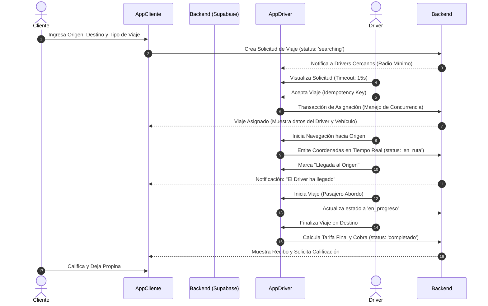
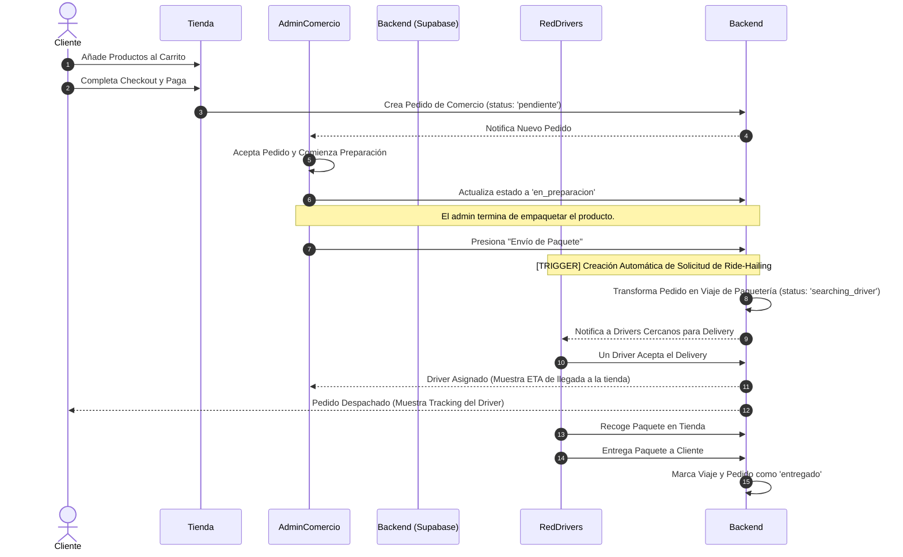
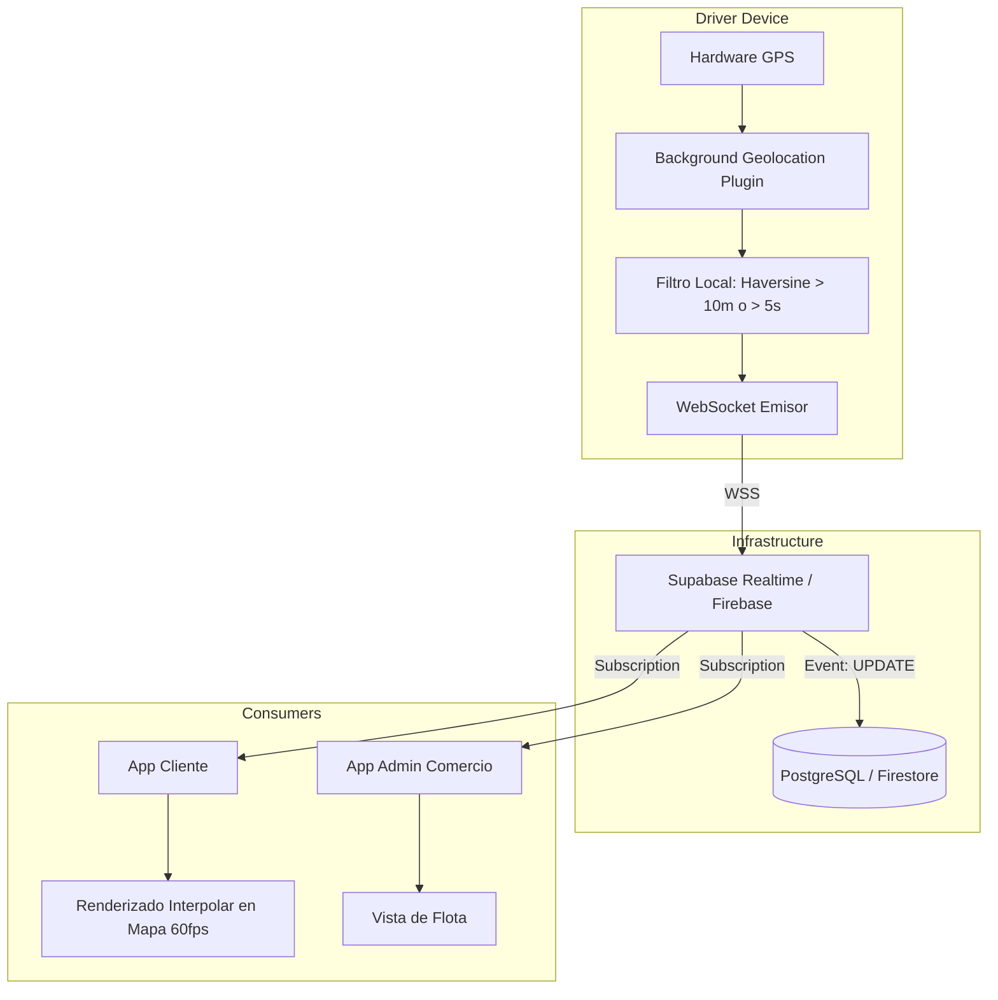

# Blueprint Arquitectónico y Diagramas de Flujo del Sistema

Este documento describe la arquitectura base, los ciclos de vida de negocio y las pipelines de infraestructura críticas para el funcionamiento de "Un 2x3". El sistema se divide funcionalmente en Ride-Hailing, E-Commerce con Despacho, y Tracking GPS, operando bajo un entorno híbrido React/Capacitor/Flutter respaldado por Supabase y Firebase.

## 1. Flujo de Ride-Hailing (Taxi)
El ciclo de vida del servicio de transporte desde la solicitud inicial hasta la confirmación del pago.

## 2. Flujo Híbrido de Comercio / Delivery (CRÍTICO)
Este flujo integra el ciclo de e-commerce tradicional con la red de conductores del sistema Ride-Hailing.

## 3. Pipeline de Tracking GPS
Gestión de geolocalización de alta frecuencia con mitigación de costos operativos y optimización de rendimiento.

**Lógica Técnica:**
- **Throttling:** Se limita la emisión de coordenadas desde el dispositivo del conductor (ej. solo emitir si el cambio es > 10 metros o han pasado > 5 segundos).
- **Interpolación:** Las apps consumidoras (Cliente/Comercio) utilizan animaciones para suavizar el movimiento del marcador del driver en el mapa, evitando la percepción de saltos debido al throttling.

## 4. Matriz de Roles y Permisos

| Rol | Entorno Principal | Permisos Clave | Restricciones |
| :--- | :--- | :--- | :--- |
| **Cliente** | App Móvil / PWA | - Solicitar viajes y pedir en tiendas. - Trackear estado y ubicación. - Gestionar métodos de pago. | Solo accede a sus propios datos e historial. No puede ver datos de otros usuarios. |
| **Driver** | App Móvil Nativa | - Recibir y aceptar/rechazar viajes/deliveries. - Emitir GPS en 2do plano. - Gestionar estado de disponibilidad (Online/Offline). | Solo ve los datos necesarios para completar el viaje asignado. No accede al catálogo interno del comercio. |
| **Admin de Comercio** | Panel Web / Tablet | - Gestionar catálogo de productos. - Aceptar/rechazar pedidos entrantes. - Disparar el Trigger de "Envío de Paquete". | Solo visualiza su tienda. No puede asignar drivers manualmente (el sistema lo hace). |
| **Super Admin** | Panel Web (CPanel) | - Acceso total al sistema, métricas, comisiones, bloqueos y auditorías. - CRUD completo de todas las tablas. | Uso restringido por 2FA. |
