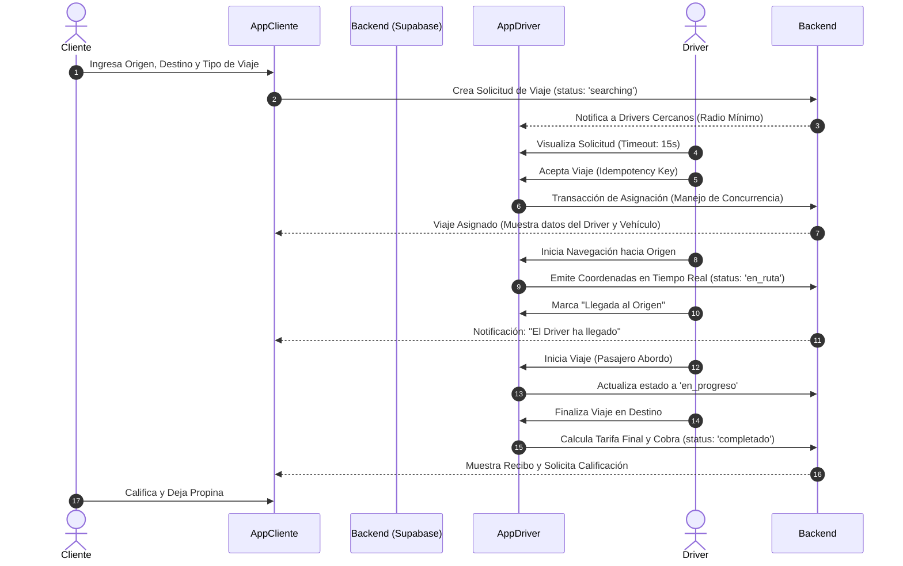
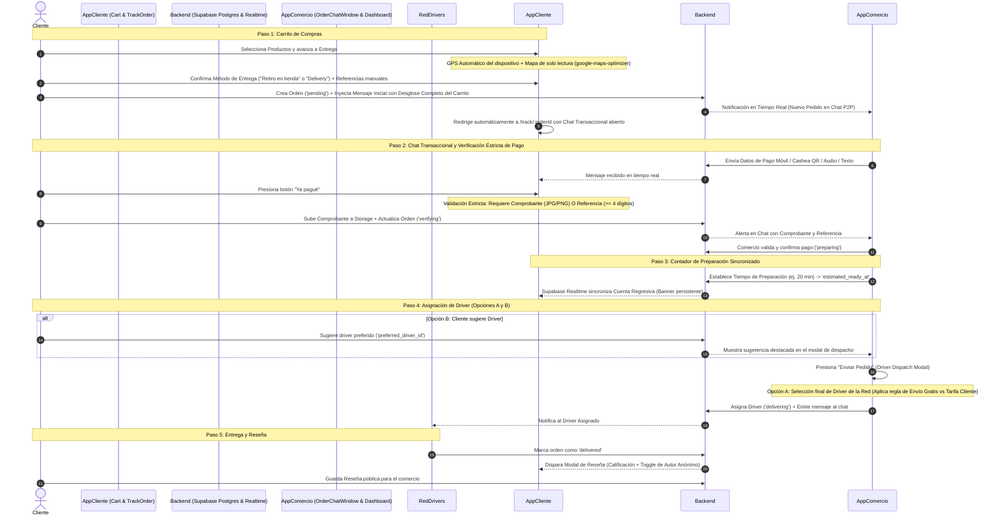
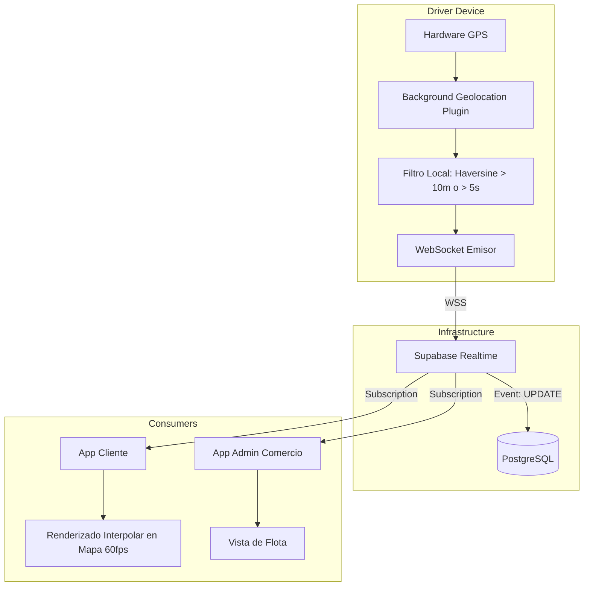

# Blueprint Arquitectónico y Diagramas de Flujo del Sistema

Este documento describe la arquitectura base, los ciclos de vida de negocio y las pipelines de infraestructura críticas para el funcionamiento de "Un 2x3". El sistema se divide funcionalmente en Ride-Hailing, E-Commerce con Despacho, y Tracking GPS, operando bajo un entorno híbrido React/Capacitor/Flutter respaldado exclusivamente por Supabase (PostgreSQL, Realtime, Storage, Auth), optimizado para alto rendimiento y máxima eficiencia operativa.

## 1. Flujo de Ride-Hailing (Taxi)
El ciclo de vida del servicio de transporte desde la solicitud inicial hasta la confirmación del pago.

## 2. Flujo Híbrido de Comercio / Delivery y Chat Transaccional (ACTUALIZADO)
Este flujo integra el ciclo de e-commerce con checkout ágil, chat transaccional P2P en tiempo real, validación estricta de pagos y red de repartidores.

### 2.1. Arquitectura del Flujo de Checkout y Chat P2P

### 2.2. Reglas de Negocio Implementadas
1. **Geolocalización Automática y Optimización de Mapas (`google-maps-optimizer`):**
   - El dispositivo obtiene las coordenadas GPS iniciales vía `@capacitor/geolocation` sin obligar al usuario a arrastrar pines complicados.
   - El mapa de Google Maps funciona como **confirmación visual en modo solo lectura** (`draggable: false`, sin uso innecesario de `Directions` ni `Distance Matrix`).
   - Se incluye un campo de texto para referencias manuales descriptivas (ej. color de fachada, número de casa, punto de referencia local).
2. **Selección Obligatoria de Entrega:**
   - La interfaz requiere bifurcar entre **"Retiro en tienda" (PickUp)** o **"Delivery"** antes de procesar el pedido.
3. **Inyección de Contexto en Chat Transaccional:**
   - Al generarse el pedido, el sistema inyecta en la tabla `messages` un primer mensaje formateado con todo el carrito (productos, cantidades, precios unitarios, subtotal, costo de envío si aplica, total y coordenadas/referencias de entrega).
4. **Validación Estricta de Pago ("Ya pagué"):**
   - No se permite avanzar el reporte sin adjuntar la captura del comprobante o sin ingresar un código de referencia bancaria válido (mínimo 4 caracteres).
   - El archivo se almacena en el bucket `documents` de Supabase Storage con fallback seguro a base64.
5. **Contador de Preparación Sincronizado:**
   - El comercio establece los minutos estimados de cocina (`15`, `20`, `30`, `45` o personalizados).
   - Se calcula `estimated_ready_at` en la orden y Supabase Realtime replica la cuenta regresiva en vivo en el banner superior del chat en ambos extremos.
6. **Despacho y Asignación de Conductor:**
   - **Opción A (Negocio elige):** El comercio selecciona al repartidor desde la lista en tiempo real. Si el comercio ofrece promoción de "Envío Gratis", el comercio asume la comisión de despacho; de lo contrario, la tarifa se transfiere al cliente.
   - **Opción B (Usuario elige/sugiere):** Mientras espera la preparación, el cliente puede explorar la lista de repartidores y proponer su conductor de confianza (`preferred_driver_id`), alertando al comercio en el chat y en el modal de despacho para su aprobación final.
7. **Sistema de Reseñas y Calificaciones con Anonimato:**
   - Al marcarse el pedido como `delivered`, se activa automáticamente el modal de calificación.
   - Cuenta con un switch "Publicar de forma anónima" que enmascara el nombre y avatar del usuario antes de persistir la reseña en la tabla pública del comercio.

## 3. Pipeline de Tracking GPS
Gestión de geolocalización de alta frecuencia con mitigación de costos operativos y optimización de rendimiento.

**Lógica Técnica:**
- **Throttling:** Se limita la emisión de coordenadas desde el dispositivo del conductor (ej. solo emitir si el cambio es > 10 metros o han pasado > 5 segundos).
- **Interpolación:** Las apps consumidoras (Cliente/Comercio) utilizan animaciones para suavizar el movimiento del marcador del driver en el mapa, evitando la percepción de saltos debido al throttling.

## 4. Matriz de Roles y Permisos

| Rol | Entorno Principal | Permisos Clave | Restricciones |
| :--- | :--- | :--- | :--- |
| **Cliente** | App Móvil / PWA | - Solicitar viajes y pedir en tiendas. - Trackear estado y ubicación. - Gestionar métodos de pago. | Solo accede a sus propios datos e historial. No puede ver datos de otros usuarios. |
| **Driver** | App Móvil Nativa | - Recibir y aceptar/rechazar viajes/deliveries. - Emitir GPS en 2do plano. - Gestionar estado de disponibilidad (Online/Offline). | Solo ve los datos necesarios para completar el viaje asignado. No accede al catálogo interno del comercio. |
| **Admin de Comercio** | Panel Web / Tablet | - Gestionar catálogo de productos. - Aceptar/rechazar pedidos entrantes. - Disparar el Trigger de "Envío de Paquete". | Solo visualiza su tienda. No puede asignar drivers manualmente (el sistema lo hace). |
| **Super Admin** | Panel Web (CPanel) | - Acceso total al sistema, métricas, comisiones, bloqueos y auditorías. - CRUD completo de todas las tablas. | Uso restringido por 2FA. |
